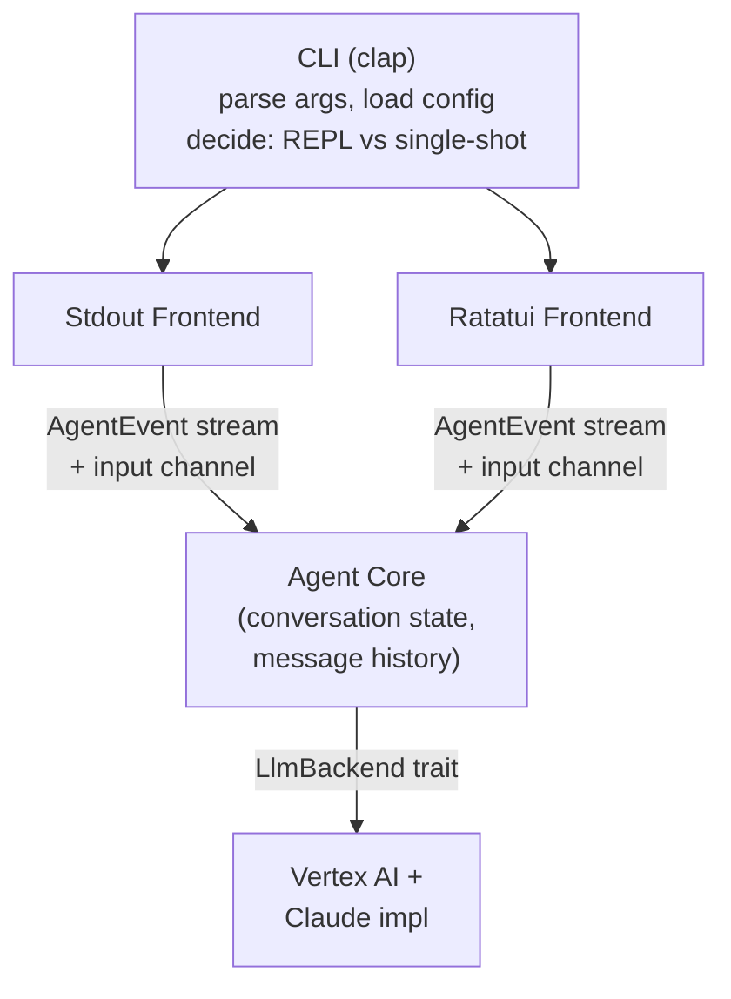

# Phase 1: Core CLI — Design Spec

## Overview

Build a CLI tool (`illustrious-manager`) that connects to Claude on Vertex AI, streams responses, and supports both an interactive REPL (via Ratatui) and a single-shot stdout mode. The architecture is designed to be backend-agnostic and frontend-agnostic, supporting future phases (tool use, sub-agents, additional LLM providers) without redesign.

## Architecture

Three decoupled layers:



### Layer 1: LLM Backend

A trait-based abstraction that any LLM provider can implement.

```rust
#[async_trait]
trait LlmBackend {
    async fn send_message(
        &self,
        messages: &[Message],
        config: &RequestConfig,
    ) -> Result<impl Stream<Item = Result<StreamEvent>>>;
}

enum StreamEvent {
    TextDelta(String),
    Done,
}

struct Message {
    role: Role,
    content: String,
}

enum Role {
    User,
    Assistant,
}

struct RequestConfig {
    model: String,
}
```

- `StreamEvent` is intentionally minimal for Phase 1. Later phases add variants like `ToolUse`, `Thinking`, etc.
- `RequestConfig` is separate from global config so each call can override settings (e.g. different model per request).
- The trait returns a `Stream` so consumers can process tokens as they arrive.

### Layer 2: Agent Core

Owns conversation state and orchestrates the flow between user input and LLM responses.

```rust
struct Agent {
    backend: Box<dyn LlmBackend>,
    history: Vec<Message>,
}

impl Agent {
    async fn send(&mut self, input: String) -> Result<impl Stream<Item = AgentEvent>>;
}

enum AgentEvent {
    TokenReceived(String),
    ResponseComplete(String),  // full assembled response
    Error(String),
}
```

The `send` method:
1. Appends the user message to `history`
2. Calls `backend.send_message(&self.history, &config)`
3. Wraps the backend's `StreamEvent`s into `AgentEvent`s, accumulating the full response
4. On `StreamEvent::Done`, appends the assistant's complete response to `history` and emits `ResponseComplete`

The agent is display-agnostic. It takes strings in and emits events out. It does not know about the terminal, Ratatui, or stdout.

**Sub-agent support (future):** The design naturally supports nesting. `Agent` is a plain struct with per-instance history and an injectable backend. A parent agent can create child `Agent` instances with their own history and event streams.

### Layer 3: Frontends

Both frontends consume `AgentEvent` streams from the agent core. They share no code with each other but use the same agent interface.

#### Stdout Frontend (single-shot mode)

Subscribes to the agent's event stream and prints tokens to stdout as they arrive. Exits on response completion. Works with pipes and redirects.

#### Ratatui Frontend (REPL mode)

A TUI with two main areas:
- **Response area** — scrollable region displaying the conversation, tokens streaming in live
- **Input area** — text input at the bottom for user messages

The event loop handles two sources concurrently:
1. **Terminal events** (key presses) via `crossterm`
2. **Agent events** (tokens, completion) via the agent's stream

When the user submits input, it sends the message to the agent and switches to a "streaming" state where tokens render into the response area. On completion, the input area re-activates for the next turn.

Phase 1 keeps the TUI simple: no markdown rendering (raw text), basic scrollback, minimal chrome.

**`/` command routing (future):** The Ratatui frontend is the natural place to intercept `/` commands. Input starting with `/` would be checked against built-in commands first (e.g. `/git`, `/quit`, `/clear`), and forwarded to the agent if no match is found (e.g. skills). This is a frontend concern — the agent core stays unaware of `/` commands.

## Vertex AI + Claude Implementation

The first `LlmBackend` implementation targets Claude models on Vertex AI via the Anthropic messages API.

- **Authentication:** Application Default Credentials (ADC) via the `gcp_auth` crate. Users authenticate via `gcloud auth application-default login` or a service account.
- **Endpoint:** `POST https://{region}-aiplatform.googleapis.com/v1/projects/{project}/locations/{region}/publishers/anthropic/models/{model}:streamRawPredict`
- **Streaming:** The endpoint returns Server-Sent Events (SSE). The implementation parses SSE frames into `StreamEvent::TextDelta` and `StreamEvent::Done`.
- **HTTP client:** `reqwest` with streaming response body.

## Configuration

### Config file

Location: `~/.config/illustrious-manager/config.toml`

```toml
[vertex]
# Required: your GCP project ID
project = ""
# Vertex AI region
region = "us-east5"
# Model to use
model = "claude-sonnet-4-20250514"
```

**Auto-creation:** On first launch, if no config file exists, it is created with the template above. Default values are populated where sensible; `project` is left blank as it must be user-provided.

**Validation:** If `project` is empty when a message is sent, the tool displays a clear error pointing the user to the config file location.

### CLI flags

```
illustrious-manager [OPTIONS] [PROMPT]

Options:
  --project <PROJECT>    GCP project ID
  --region <REGION>      Vertex AI region
  --model <MODEL>        Model identifier
  --single-shot          Run in single-shot mode (requires PROMPT)
  --config <PATH>        Custom config file path
```

### Resolution order

Config file values are loaded first. CLI flags override any config file value.

### Mode selection

- No args → REPL
- `PROMPT` arg → REPL, with prompt sent as the first message
- `--single-shot "prompt"` → stdout streaming, exit on completion
- `--single-shot` without `PROMPT` → error with usage hint

## Dependencies

| Crate | Purpose |
|-------|---------|
| `tokio` | Async runtime |
| `reqwest` | HTTP client + SSE streaming |
| `gcp_auth` | ADC token acquisition for Vertex AI |
| `clap` | CLI argument parsing |
| `serde` / `serde_json` | JSON serialization (API requests/responses) |
| `toml` | Config file parsing |
| `ratatui` | TUI framework for REPL mode |
| `crossterm` | Terminal backend for Ratatui + raw input handling |
| `futures` | Stream combinators for async streams |
| `dirs` | XDG config directory resolution |
| `anyhow` | Application-level error handling |

## Out of Scope (Future Phases)

- Tool use (file read/write, bash execution)
- Markdown rendering in the TUI
- `/` command system
- Sub-agent spawning
- Additional LLM backends (Gemini, direct Anthropic API)
- System prompts
- Retry/resilience logic
